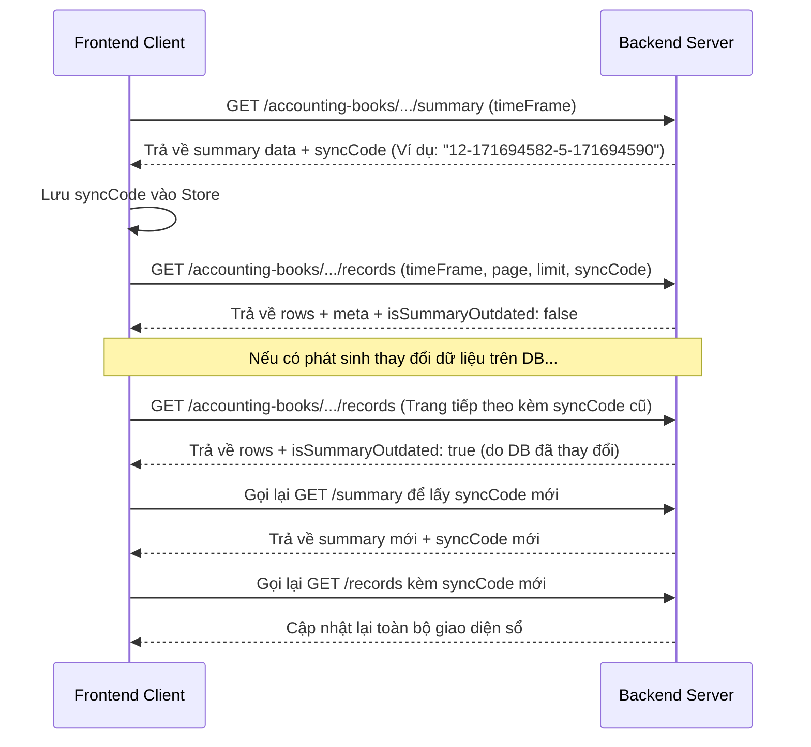

# Hướng Dẫn Tích Hợp & Giải Đáp Nghiệp Vụ Module Sổ Kế Toán (Accounting Books)
## Phù Hợp Thông Tư 152/2025/TT-BTC (FE ↔ BE)

Tài liệu này phản hồi bản kế hoạch tích hợp [plan_api_accounting_books.md](file:///e:/financial-tax-system_BE/docs-coding-guidelines/plan_api_accounting_books.md) của Frontend (FE), làm rõ sự thay đổi nghiệp vụ quan trọng theo **Thông tư 152/2025/TT-BTC** (thay thế Thông tư 88/2021/TT-BTC), giải đáp các điểm mâu thuẫn thiết kế và hướng dẫn tích hợp chi tiết.

---

## 1. Sự Thay Đổi Trọng Yếu Theo Thông Tư 152/2025/TT-BTC
Theo quy định mới nhất tại Thông tư 152/2025/TT-BTC, mẫu sổ chi phí cũ (**S2** với 5 cột chi phí) đã bị thay thế hoàn toàn bằng mẫu sổ chi tiết doanh thu, chi phí mới (**S2c** với 6 cột chi phí). 

### 1.1. Bản đồ ánh xạ Phân loại Chi phí (S2c Expense Mapping)
Để đồng bộ với thay đổi này, Backend đã cập nhật trường `s2cExpenseMapping` dạng Enum trong bảng danh mục và phiếu chi. 

Dưới đây là bảng ánh xạ chi tiết giữa mã Enum của BE và các cột chi phí trên sổ S2c của FE:

| Mã Enum của BE | Cột tương ứng trên Sổ S2c | Diễn giải nội dung | Ghi chú & Ví dụ hạng mục |
| :--- | :---: | :--- | :--- |
| **`ITEM_A`** | **Mục a** | Nguyên liệu, vật liệu | Mua vật tư, nguyên liệu phục vụ sản xuất, kinh doanh. |
| **`ITEM_B`** | **Mục b** | Lương, bảo hiểm và các khoản nộp theo lương | Trả lương nhân viên, đóng BHXH, BHYT, BHTN,... |
| **`ITEM_C`** | **Mục c** | Khấu hao tài sản cố định | Khấu hao máy móc, thiết bị, phương tiện vận tải,... |
| **`ITEM_D`** | **Mục d** | Dịch vụ mua ngoài | Tiền điện, nước, internet, thuê văn phòng, tư vấn pháp lý,... |
| **`ITEM_E`** | **Mục đ** | Lãi vay phải trả | Chi phí lãi vay ngân hàng, tổ chức tín dụng. |
| **`ITEM_F`** | **Mục e** | Chi phí khác | Thuế, phí, lệ phí và các chi phí hợp lệ khác ngoài các mục trên. |
| **`NONE`** | *N/A* | Không thuộc chi phí giảm trừ thuế | Danh mục thuộc phiếu thu hoặc chi tiêu cá nhân không giảm trừ. |

### 1.2. Mặc định tự động khi tạo Danh mục mới
* Khi người dùng tạo một danh mục chi tiêu mới (`type === 'PAYMENT'`), nếu FE không truyền `s2cExpenseMapping`, BE sẽ tự động gán giá trị mặc định là **`ITEM_F` (Chi phí khác)**.
* Nếu là danh mục thu (`type === 'RECEIPT'`), BE mặc định gán là **`NONE`**.

---

## 2. Giải Đáp Mâu Thuẫn & Điều Chỉnh Thiết Kế Frontend Plan

Dựa trên đề xuất tại [plan_api_accounting_books.md](file:///e:/financial-tax-system_BE/docs-coding-guidelines/plan_api_accounting_books.md), Backend đã có các điều chỉnh kỹ thuật để tối ưu hóa việc tích hợp như sau:

### 2.1. Cải tiến lớn: Loại bỏ logic "Keyword Guessing" ở Frontend
* **Vấn đề FE lo ngại:** Cột `Hang_Muc` chỉ trả về tên danh mục dạng chuỗi (ví dụ: `"Trả lương"`, `"Thuê kho"`). FE lo ngại phải viết Regex để tự suy luận (infer) xem danh mục đó thuộc cột nào (a, b, c, d, đ, e) trên sổ S2c.
* **Giải pháp của BE:** Backend **ĐÃ bổ sung** trường `s2cExpenseMapping` trực tiếp vào DTO dòng dữ liệu của API danh sách chi phí.
  * **Endpoint:** `GET /v1/accounting-books/expense/records`
  * **Cập nhật trong row:** Trả về thêm trường `s2cExpenseMapping` chứa giá trị Enum (`ITEM_A` đến `ITEM_F`).
  * **Hướng dẫn cho FE:** Frontend chỉ việc đọc trực tiếp trường `s2cExpenseMapping` từ dòng bản ghi để đưa vào cột tương ứng trên bảng hiển thị/xuất Excel. **Tuyệt đối không được tự suy đoán hoặc parse text từ tên hạng mục.**

### 2.2. Điều chỉnh tham số thời gian (Query Parameters)
* **Sai lệch ở FE Plan:** Kế hoạch của FE ghi nhận các query param là `startDate` và `endDate` dạng Date string cho các endpoint sổ sách.
* **Thiết kế thực tế của BE:** Backend **không nhận** `startDate`/`endDate` trực tiếp qua query params. Bộ lọc thời gian hoạt động như sau:
  * **Query chính:** `timeFrame` nhận một trong các giá trị: `"thang_nay"` | `"thang_truoc"` | `"quy_nay"` | `"custom"`.
  * **Trường hợp `"custom"`:** FE bắt buộc phải gửi kèm **`year`** (ví dụ: `2026`) và **`quarter`** (giá trị từ `1` đến `4`).
  * **Ví dụ gọi API Custom:** `GET /v1/accounting-books/revenue/records?timeFrame=custom&year=2026&quarter=2`

### 2.3. Quy cách tham số lọc sản phẩm trong Sổ tồn kho (S2d)
* **Sai lệch ở FE Plan:** FE mô tả gửi mảng ID sản phẩm hoặc comma-separated array.
* **Thiết kế thực tế của BE:** Lọc nhiều sản phẩm qua query parameter `productPublicIds` dưới dạng **chuỗi phân tách bằng dấu phẩy**.
  * **Ví dụ:** `/v1/accounting-books/inventory/records?timeFrame=thang_nay&productPublicIds=prod-102,prod-105`
  * **Trường hợp chọn "TẤT CẢ" (ALL):** Frontend không truyền tham số `productPublicIds` lên API (bỏ trống).

### 2.4. Lưu ý về việc gọi Sổ dòng tiền (S2e / S03 / S04)
* **Cơ chế truy vấn:** 
  * `GET /v1/accounting-books/cash-flow/summary` trả về thống kê hợp nhất của cả hai quỹ: S03 (Tiền mặt - `CASH`) và S04 (Tiền gửi ngân hàng - `BANK`).
  * `GET /v1/accounting-books/cash-flow/records` yêu cầu truyền tham số `bookKey` để lọc:
    * `bookKey=S03` để lấy sổ tiền mặt.
    * `bookKey=S04` để lấy sổ tiền gửi ngân hàng.
  * **Xử lý filter "TẤT CẢ" (ALL) trên giao diện S2e:** FE cần thực hiện gọi song song hoặc tuần tự cả 2 request (cho `S03` và `S04`), sau đó Mapper gộp và sắp xếp lại theo thời gian giao dịch (`ngay_chung_tu` tăng dần) để hiển thị.

---

## 3. Hướng Dẫn Kỹ Thuật Tích Hợp API

### 3.1. Luồng Fetch dữ liệu chuẩn hóa với `syncCode`
Để đảm bảo dữ liệu hiển thị trên biểu đồ tổng quan (Summary Card) và bảng chi tiết (Records) hoàn toàn đồng bộ (không bị lệch số nếu có nhân viên khác thêm/sửa chứng từ trong lúc đang xem), FE phải tuân thủ nghiêm ngặt quy trình sau:



---

## 4. Đặc tả API Sổ Chi Phí S2c-HKD (Chi Tiết & Ví dụ)

Dưới đây là định dạng JSON chính xác của API Sổ chi phí để FE xây dựng Mapper.

### 4.1. Lấy Summary Sổ chi phí
* **Route:** `/v1/accounting-books/expense/summary`
* **Method:** `GET`
* **Query Params:** `timeFrame`, `year` (nếu custom), `quarter` (nếu custom).
* **Response Data:**
```json
{
  "success": true,
  "statusCode": 200,
  "timestamp": "2026-05-29T06:55:00.000Z",
  "message": "Retrieve expense book summary successfully",
  "data": {
    "activeBookKey": "S2c-HKD",
    "books": {
      "S2c-HKD": {
        "bookMetadata": {
          "businessName": "Hộ Kinh Doanh Nguyễn Văn Tuấn",
          "taxCode": "0102030405",
          "bookTitle": "Sổ chi tiết doanh thu, chi phí (Mẫu S2c-HKD)",
          "ownerName": "Nguyễn Văn Tuấn",
          "templateStyle": "CIRCULAR_152"
        },
        "bookKey": "S2C",
        "timeFrame": {
          "startDate": "2026-05-01T00:00:00.000Z",
          "endDate": "2026-05-31T23:59:59.999Z"
        },
        "summary": {
          "chi_phi_nguyen_vat_lieu": 15000000.00,
          "chi_phi_nhan_cong": 8000000.00,
          "chi_phi_khau_hao": 3000000.00,
          "chi_phi_dich_vu_mua_ngoai": 5400000.00,
          "chi_phi_lai_vay": 1200000.00,
          "chi_phi_khac": 800000.00,
          "tong_chi_phi_hop_le": 33400000.00
        }
      }
    },
    "syncCode": "8-1716960000000"
  }
}
```

### 4.2. Lấy Records Chi tiết Sổ chi phí
* **Route:** `/v1/accounting-books/expense/records`
* **Method:** `GET`
* **Query Params:** `timeFrame`, `year`, `quarter`, `page`, `limit`, `syncCode`.
* **Response Data:**
```json
{
  "success": true,
  "statusCode": 200,
  "timestamp": "2026-05-29T06:55:10.000Z",
  "message": "Retrieve expense book successfully",
  "data": {
    "rows": [
      {
        "Ngay_Chi": "2026-05-15T08:30:00.000Z",
        "So_Phieu_Chi": "PC-0526-0001",
        "Hang_Muc": "Chi mua nguyên liệu gỗ thông",
        "Dien_Giai": "Thanh toán tiền mua gỗ thông cho xưởng sản xuất",
        "So_Tien": 15000000,
        "Hoa_Don_Chung_Tu_Kem_Theo": "HD-2026-00342",
        "s2cExpenseMapping": "ITEM_A"
      },
      {
        "Ngay_Chi": "2026-05-28T17:00:00.000Z",
        "So_Phieu_Chi": "PC-0526-0002",
        "Hang_Muc": "Trả lương nhân viên tháng 5",
        "Dien_Giai": "Thanh toán lương cho nhân sự văn phòng và xưởng",
        "So_Tien": 8000000,
        "Hoa_Don_Chung_Tu_Kem_Theo": "",
        "s2cExpenseMapping": "ITEM_B"
      }
    ],
    "meta": {
      "total": 2,
      "page": 1,
      "lastPage": 1
    },
    "activeBookKey": "S2c-HKD",
    "syncCode": "8-1716960000000",
    "isSummaryOutdated": false
  }
}
```

---

## 5. Hướng Dẫn Nghiệp Vụ Cho Lập Trình Viên Frontend khi Xuất File (Excel / PDF)

Vì hệ thống thiết kế **không có API sinh file Excel/PDF từ phía Backend**, toàn bộ nghiệp vụ tạo và tải file này được xử lý hoàn toàn ở Frontend client-side bằng thư viện `xlsx` (Excel) và `jspdf` / `jspdf-autotable` (PDF).

### 5.1. Ràng buộc thu thập đủ dữ liệu trước khi xuất file (Full-Dataset Fetching)
* API Records hỗ trợ phân trang (`page`, `limit`). Do đó, dữ liệu hiển thị hiện tại trên bảng có thể chỉ là trang 1 (ví dụ: 20 dòng đầu).
* **Ràng buộc kiểm soát:** Khi người dùng bấm nút **"Xuất Excel"** hoặc **"Xuất PDF"**, FE **không được phép** chỉ lấy dữ liệu đang hiển thị trên bảng.
* **Cách thực hiện:** 
  1. FE gọi API records trang 1 để lấy thông tin tổng số trang (`meta.lastPage`).
  2. Thực hiện vòng lặp hoặc gọi song song các trang từ `1` đến `lastPage` **kèm theo cùng một `syncCode` hiện tại** để lấy toàn bộ dữ liệu dòng chứng từ của kỳ đó.
  3. Gộp toàn bộ dòng lại thành một mảng và truyền vào hàm render Excel/PDF.

### 5.2. Đảm bảo Tiêu chuẩn Biểu mẫu Sổ sách (Circular/Template Layout)
* Thông tin doanh nghiệp (Tên HKD, Mã số thuế, Chủ hộ) phải được lấy từ `bookMetadata` của API Summary để điền vào Header bên trái của file xuất.
* Footer phải ghi rõ Ngày lập biểu, chữ ký của Người ghi sổ và Người đại diện hộ kinh doanh.
* Với định dạng PDF, FE cần nhúng Font chữ Tiếng Việt Base64 (ví dụ: Arial hoặc Times New Roman) vào `jsPDF` bằng phương thức `doc.addFont()` để tránh tình trạng hiển thị lỗi font chữ có dấu tiếng Việt.
