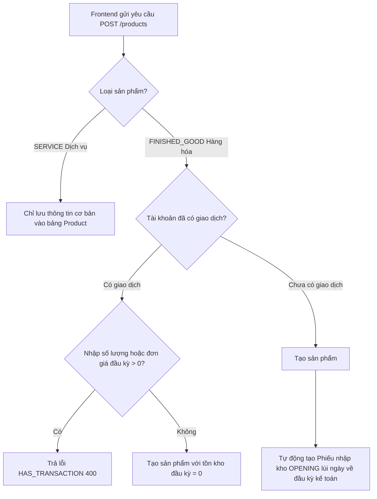
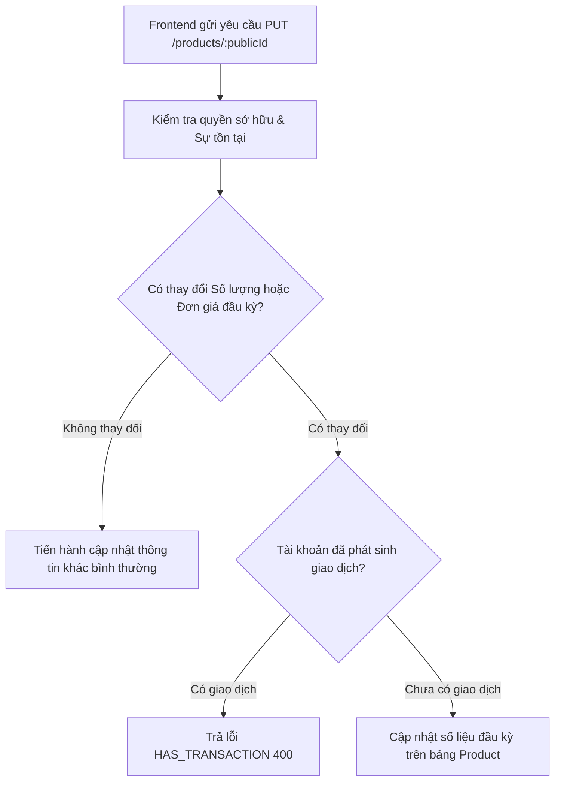

# Hướng dẫn Tích hợp API Module Products (Hàng hóa/Dịch vụ)

Tài liệu này được biên soạn để điều chỉnh thiết kế tích hợp giữa Frontend (FE) và Backend (BE), giải quyết các mâu thuẫn trong kế hoạch gọi API của Frontend (file `plan_call_api_product(update).md`), đồng thời hướng dẫn chi tiết luồng nghiệp vụ và cách xử lý lỗi hệ thống liên quan đến Module **Products (Hàng hóa/Dịch vụ)**.

---

## 1. Đính chính Thiết kế Hệ thống (BE Real Architecture)

> [!IMPORTANT]
> **ĐÍNH CHÍNH QUAN TRỌNG:**
> Kế hoạch tích hợp cũ của Frontend giả định rằng tồn kho đầu kỳ đã được tách biệt (Decoupled Stock) hoàn toàn sang một API Inventory riêng biệt (FE gọi API tạo sản phẩm trước, sau đó gọi tiếp API gán số dư đầu kỳ).
> **Thực tế hệ thống (Backend):**
>
> - Dữ liệu số dư đầu kỳ (`openingStockQuantity`, `openingStockUnitCost`) **vẫn được xử lý trực tiếp** trong API tạo (`POST /products`) và cập nhật (`PUT /products/:publicId`).
> - **Không có API Inventory riêng** để gán số dư đầu kỳ từ client. Backend sẽ **tự động xử lý ngầm** bằng database transaction: Khi sản phẩm hàng hóa được tạo, BE sẽ tự tạo một Phiếu nhập kho đầu kỳ (`StockReceipt` nguồn `OPENING`) tương ứng.
> - Frontend **chỉ cần gọi duy nhất API Products** kèm theo thông tin tồn kho đầu kỳ.

---

## 2. Bản Đồ API Module Products

Tất cả các API dưới đây yêu cầu Header `Authorization: Bearer <token>` và chịu sự giám sát của `PeriodLockGuard` (chặn thao tác nếu kỳ tài chính hiện tại đã bị đóng).

| Chức năng             |  Method  | Endpoint              | Content-Type          | Mô tả                                                                                        |
| :-------------------- | :------: | :-------------------- | :-------------------- | :------------------------------------------------------------------------------------------- |
| **Thống kê sản phẩm** |  `GET`   | `/products/summary`   | `application/json`    | Lấy tổng sản phẩm, số lượng theo loại, tổng giá trị tồn kho đầu kỳ và số lượng sắp hết hàng. |
| **Lấy danh sách**     |  `GET`   | `/products`           | `application/json`    | Lấy danh sách phân trang. Hỗ trợ query `page`, `limit`, và bộ lọc `productType`.             |
| **Chi tiết sản phẩm** |  `GET`   | `/products/:publicId` | `application/json`    | Lấy thông tin chi tiết một sản phẩm qua mã `publicId`.                                       |
| **Tạo sản phẩm**      |  `POST`  | `/products`           | `multipart/form-data` | Tạo sản phẩm mới kèm ảnh (tùy chọn).                                                         |
| **Cập nhật sản phẩm** |  `PUT`   | `/products/:publicId` | `multipart/form-data` | Cập nhật thông tin sản phẩm và/hoặc tải ảnh mới.                                             |
| **Xóa sản phẩm**      | `DELETE` | `/products/:publicId` | `application/json`    | Xóa sản phẩm khỏi danh mục sản phẩm của hộ kinh doanh.                                       |

> [!WARNING]
> Router NestJS định tuyến `/products/summary` **trước** `/products/:publicId`. Frontend hãy gọi đúng endpoint để tránh việc `summary` bị hiểu lầm thành một mã `publicId`.

---

## 3. Luồng Nghiệp Vụ & Logic Flow (Backend)

### 3.1. Luồng Tạo Mới (POST `/products`)



1. **Đối với Dịch vụ (`productType = 'SERVICE'`):**
   - Hệ thống chỉ lưu thông tin catalog, các trường liên quan đến tồn kho (`openingStockQuantity`, `openingStockUnitCost`, `openingStockValue`, `currentStock`) luôn được ép về `0` hoặc `null` ở DB.
2. **Đối với Hàng hóa (`productType = 'FINISHED_GOOD'`):**
   - Nếu tài khoản **chưa phát sinh giao dịch nào** (hóa đơn, phiếu nhập/xuất kho): Cho phép nhập số lượng và đơn giá vốn đầu kỳ tùy ý. BE sẽ tự động tạo một phiếu nhập kho dạng `OPENING` tại ngày bắt đầu của kỳ tài chính hiện hành.
   - Nếu tài khoản **đã phát sinh bất kỳ giao dịch nào**: Hệ thống cấm tạo sản phẩm có sẵn số lượng đầu kỳ và đơn giá vốn đầu kỳ > 0 để tránh làm sai lệch báo cáo thuế Sổ S2d-HKD. Trả về mã lỗi `HAS_TRANSACTION`.

---

### 3.2. Luồng Cập Nhật (PUT `/products/:publicId`)



1. **Không thay đổi số liệu đầu kỳ:**
   - Người dùng chỉ sửa đổi tên sản phẩm, đơn vị tính, giá bán, thuế suất, hoặc tải lên ảnh mới. Hệ thống xử lý cập nhật thành công.
2. **Có thay đổi số liệu đầu kỳ:**
   - Hệ thống so sánh giá trị gửi lên với dữ liệu hiện có trong Database.
   - Nếu tài khoản đã phát sinh giao dịch $\rightarrow$ Chặn hành động và trả về lỗi `HAS_TRANSACTION`.
   - Nếu tài khoản chưa có giao dịch $\rightarrow$ Cập nhật thông tin đầu kỳ và tính toán lại `openingStockValue = Quantity * UnitCost`.

---

## 4. Đặc Tả Lỗi `HAS_TRANSACTION` & Hướng Xử Lý trên Frontend

Khi người dùng cố tình vi phạm nguyên tắc nhập kho đầu kỳ (tạo/sửa số lượng hoặc đơn giá vốn đầu kỳ khi tài khoản đã hoạt động), Backend sẽ phản hồi lỗi `400 Bad Request` với cấu trúc JSON sau:

```json
{
  "message": "Transactions have occurred in the account. Please enter the quantity and cost price from the stock receipt instead of entering them directly.",
  "errorCode": "HAS_TRANSACTION",
  "statusCode": 400
}
```

### Frontend nên làm gì để xử lý lỗi này?

1. **Hiển thị thông báo thân thiện (Toast/Alert):**
   - Khi nhận được phản hồi lỗi có `errorCode === 'HAS_TRANSACTION'`, hãy hiển thị thông báo:
     _"Tài khoản đã bắt đầu phát sinh các giao dịch xuất/nhập/bán hàng. Bạn không thể tự ý sửa đổi số lượng hoặc đơn giá vốn đầu kỳ trực tiếp tại đây. Vui lòng tạo Phiếu nhập kho để điều chỉnh lượng tồn kho của hàng hóa này."_
2. **Tối ưu hóa Trải nghiệm Người dùng (UX Khuyến nghị):**
   - **Khi tạo sản phẩm mới:** Nếu hệ thống của hộ kinh doanh đã hoạt động, FE nên chủ động ẩn hoặc vô hiệu hóa (disable) hai trường `Số lượng đầu kỳ` và `Giá vốn đầu kỳ` trên giao diện, kèm theo dòng chú thích nhỏ để người dùng hiểu luồng nghiệp vụ trước khi bấm gửi.
   - **Khi sửa sản phẩm:** Disable ô nhập `Số lượng đầu kỳ` và `Giá vốn đầu kỳ` nếu phát hiện sản phẩm/tài khoản đã có giao dịch, tránh để người dùng mất công sửa đổi rồi mới nhận báo lỗi từ API.

---

## 5. Quy Tắc Ánh Xạ Dữ Liệu (Field Mapping)

Để đảm bảo Frontend không bị lỗi kiểu dữ liệu và giữ nguyên cấu trúc snake_case nội bộ, FE cần áp dụng bảng ánh xạ DTO sau đây:

### 5.1. Bảng ánh xạ thuộc tính (DTO ↔ FE Entity)

| Trường trên Backend (CamelCase) | Loại dữ liệu BE | Trường tương ứng trên Frontend (Snake_case) | Quy tắc ánh xạ                                               |
| :------------------------------ | :-------------: | :------------------------------------------ | :----------------------------------------------------------- |
| `publicId`                      |    `string`     | `id`                                        | Khóa chính của FE. BE ẩn khóa ngoại `id` dạng số để bảo mật. |
| `skuCode`                       |    `string`     | `sku_code`                                  | `sku_code = dto.skuCode ?? ''`                               |
| `productName`                   |    `string`     | `product_name`                              | Gán trực tiếp                                                |
| `productType`                   |     `enum`      | `product_type`                              | Hỗ trợ: `FINISHED_GOOD` (Hàng hóa), `SERVICE` (Dịch vụ)      |
| `unit`                          |    `string`     | `unit`                                      | Gán trực tiếp                                                |
| `imageUrl`                      |    `string`     | `image_url`                                 | `image_url = dto.imageUrl ?? ''`                             |
| `currentStock`                  |    `number`     | `current_stock`                             | Nếu `SERVICE` thì gán `null`. Ngược lại ép kiểu về số.       |
| `openingStockQuantity`          |    `number`     | `opening_stock_quantity`                    | Nếu `SERVICE` thì gán `null`.                                |
| `openingStockUnitCost`          |    `number`     | `opening_stock_unit_cost`                   | Nếu `SERVICE` thì gán `null`.                                |
| `openingStockValue`             |    `number`     | `opening_stock_value`                       | `Quantity * UnitCost` (Nếu `SERVICE` thì gán `null`).        |
| `sellingPrice`                  |    `number`     | `selling_price`                             | Ép kiểu về số.                                               |
| `taxCategoryId`                 |    `number`     | `tax_category_id`                           | Nullable. Dùng để map nhóm ngành thuế suất.                  |
| `createdAt`                     |    `string`     | `created_at`                                | Chuỗi định dạng ISO Date.                                    |

### 5.2. Cách thức gửi dữ liệu ảnh (Multipart/Form-Data)

- Khi tải ảnh sản phẩm lên: Frontend bắt buộc phải đóng gói các trường dữ liệu vào đối tượng `FormData` và gửi đi với header `Content-Type: multipart/form-data`.
- File ảnh nhị phân phải được đính kèm vào thuộc tính tên là `file`.
- **Cập nhật không thay đổi ảnh:** Không cần đính kèm thuộc tính `file` trong `FormData`. Backend sẽ tự động giữ nguyên ảnh cũ đang có.

---

## 6. Ví Dụ Cấu Trúc Request Payload

### 6.1. Tạo mới Hàng hóa (FINISHED_GOOD)

- **Method:** `POST`
- **Route:** `/products`
- **Content-Type:** `multipart/form-data`
- **Body:**

```ini
productName: "Giày Thể Thao Sneaker"
productType: "FINISHED_GOOD"
skuCode: "SP-GI-001"
unit: "Đôi"
sellingPrice: "450000"
openingStockQuantity: "10"
openingStockUnitCost: "250000"
taxCategoryId: "11"
file: [Binary File]
```

### 6.2. Tạo mới Dịch vụ (SERVICE)

- **Method:** `POST`
- **Route:** `/products`
- **Content-Type:** `multipart/form-data` (hoặc `application/json` nếu không truyền file)
- **Body:**

```ini
productName: "Dịch vụ Bảo Trì Phần Mềm"
productType: "SERVICE"
unit: "Lần"
sellingPrice: "1000000"
taxCategoryId: "13"
```

_(Đối với Dịch vụ, không truyền `openingStockQuantity` và `openingStockUnitCost`, BE mặc định gán bằng `0`)_
