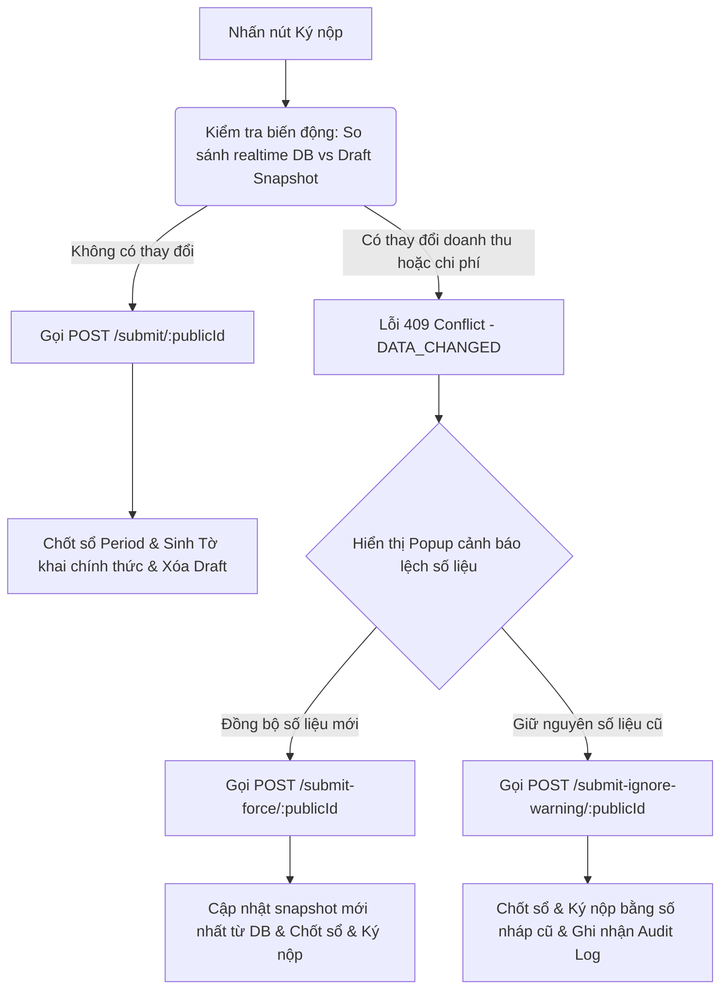

# Hướng Dẫn Tích Hợp & Nghiệp Vụ Kê Khai Thuế, Kỳ Tài Chính & Sổ Kế Toán (FE ↔ BE)

Tài liệu này cung cấp hướng dẫn tích hợp chi tiết cho Frontend (FE) về ba module core liên quan chặt chẽ: **Kỳ tài chính (Financial Periods)**, **Kê khai thuế (Tax Declaration)** và **Sổ sách kế toán (Accounting Books)**, làm rõ các logic nghiệp vụ quan trọng theo quy định mới, cơ chế đồng bộ `syncCode` và khóa kỳ kế toán.

---

## 1. Module Kỳ Tài Chính (Financial Periods)

Module Kỳ tài chính quản lý vòng đời kế toán của Hộ kinh doanh (HKD) theo từng tháng hoặc quý. Mỗi kỳ có 2 trạng thái chính: `OPEN` (Đang mở - cho phép sửa chứng từ) và `CLOSED` (Đã khóa sổ - chỉ đọc).

### 1.1. Bản Đồ API Kỳ Tài Chính

Các API chính thức phục vụ quản lý kỳ tài chính (yêu cầu Bearer Token):

| Chức năng | Method | Endpoint | Payload / Query | Ràng buộc nghiệp vụ |
| :--- | :---: | :--- | :--- | :--- |
| **Lấy danh sách kỳ** | `GET` | `/financial-periods` | Query: `page`, `limit`, `status` | Trả về danh sách các kỳ kế khai của HKD kèm trạng thái và thời gian. |
| **Chi tiết kỳ** | `GET` | `/financial-periods/:id` | Tham số `:id` (publicId của kỳ) | Trả về chi tiết 1 kỳ kế khai gồm số thuế phải nộp, số ngày chậm nộp (`countExpireDate`) và số tiền chậm nộp phạt (`penaltyAmount`). |
| **Thống kê tổng quan** | `GET` | `/financial-periods/summary` | Không có | Lấy số lượng kỳ đang mở, kỳ quá hạn chưa nộp thuế, và tổng số tiền thuế đã nộp. |
| **So sánh thuế PIT** | `GET` | `/financial-periods/:id/compare-pit` | Tham số `:id` (publicId của kỳ) | Đối chiếu mức thuế PIT thu nhập cá nhân ở các cấu hình khác nhau. |
| **Mở lại kỳ kế toán** | `PATCH` | `/financial-periods/:id/reopen` | Tham số `:id` (publicId của kỳ) | Mở khóa kỳ kế toán đã đóng để cho phép chỉnh sửa lại chứng từ (Yêu cầu chưa nộp tiền thuế). |
| **Xác nhận nộp thuế** | `PATCH` | `/financial-periods/:id/confirm-payment` | Tham số `:id` (publicId), Body: Ngày nộp tiền | Ghi nhận HKD đã nộp thuế thành công (Chuyển trạng thái nộp thuế, chỉ Admin). |

### 1.2. Cơ Chế Khóa Kỳ Kế Toán (Period Lock / PeriodLockGuard)
* Khi một kỳ kế toán có trạng thái `status: 'CLOSED'`, hệ thống kích hoạt **`PeriodLockGuard`** để khóa cứng tất cả dữ liệu phát sinh trong kỳ đó.
* Các hành vi tạo mới (`POST`), cập nhật (`PATCH`), xóa (`DELETE`) trên các chứng từ (Hóa đơn bán ra, Phiếu nhập/xuất kho, Phiếu thu/chi) có ngày giao dịch nằm trong kỳ đã đóng sẽ bị chặn và trả về lỗi:
  ```json
  {
    "statusCode": 400,
    "message": "The financial period is closed.",
    "errorCode": "FINANCIAL_PERIOD_IS_CLOSED"
  }
  ```

---

## 2. Module Kê Khai Thuế (Tax Declaration)

Hệ thống hỗ trợ kê khai thuế tự động theo từng bước dưới dạng bản nháp (Draft). Bản nháp này lưu lại số liệu chụp nhanh (Snapshot) từ DB tại thời điểm xác nhận để tránh việc số liệu trên tờ khai bị thay đổi liên tục khi người dùng sửa chứng từ.

### 2.1. Phân Luồng Kê Khai Theo Loại Tờ Khai (declarationFormType)

Quy trình kê khai thuế tự động phân chia theo loại tờ khai mà người dùng chọn khi bắt đầu lập tờ khai, phụ thuộc vào nhóm thuế suất của kỳ kế khai (`taxGroupId`):

#### 1. Lấy danh sách tùy chọn tờ khai (`GET /tax-declaration/options/:publicId`)
Trước khi bắt đầu, FE gọi API để lấy danh sách các tờ khai được phép sử dụng trong kỳ kế khai:
* **Nhóm Miễn Thuế (`taxGroupId === 1`)**: Chỉ được chọn tờ khai `01_TKN_CNKD` (Tờ khai thuế năm).
* **Các Nhóm Khác (`taxGroupId !== 1`)**: Được chọn một trong hai loại:
  - `01_CNKD`: Tờ khai thuế theo phương pháp doanh thu (3 bước).
  - `02_CNKD_TNCN_QTT`: Tờ khai quyết toán thuế TNCN theo phương pháp lợi nhuận (5 bước).

#### 2. Luồng 3 Bước (Dành cho Form `01_CNKD` & `01_TKN_CNKD`)
* **Bước 1**: Xác nhận thông tin Hộ kinh doanh.
* **Bước 2**: Xác nhận doanh thu chịu thuế (Kèm bảng thống kê ngành nghề và giao dịch).
* **Bước 5**: Xem trước tờ khai & Ký nộp (Bỏ qua Bước 3 về Tồn kho và Bước 4 về Chi phí).
* > [!IMPORTANT]
  > Nếu FE gọi API lấy dữ liệu (`GET`) hoặc lưu dữ liệu (`POST`) của Bước 3 hoặc Bước 4 đối với luồng này, Backend sẽ chặn lại và ném lỗi `400 Bad Request` với mã lỗi `STEP_NOT_APPLICABLE` và thông điệp `"Steps 3 and 4 are not applicable for this declaration form type."`.

#### 3. Luồng 5 Bước Đầy Đủ (Dành cho Form `02_CNKD_TNCN_QTT`)
Thực hiện đầy đủ cả 5 bước:
* **Bước 1**: Xác nhận thông tin Hộ kinh doanh.
* **Bước 2**: Xác nhận doanh thu chịu thuế.
* **Bước 3**: Xác nhận tổng hợp giá trị Tồn kho.
* **Bước 4**: Xác nhận chi tiết Chi phí kinh doanh.
* **Bước 5**: Xem trước tờ khai & Ký nộp.

---

### 2.2. Bản Đồ API Tiến Trình Kê Khai Thuế

| Bước | Method | Endpoint | Request Body / Param | Mô tả & Ràng buộc nghiệp vụ |
| :---: | :---: | :--- | :--- | :--- |
| **Khởi tạo** | `GET` | `/tax-declaration/init` | Không có | Lấy kỳ thuế hiện tại cần kê khai và trạng thái nút bấm "Lập tờ khai". |
| **Tùy chọn** | `GET` | `/tax-declaration/options/:publicId` | Tham số `:publicId` (kỳ) | Lấy danh sách các loại tờ khai được phép chọn cho kỳ này. |
| **Bắt đầu** | `POST` | `/tax-declaration/start` | `{ "periodIdPublicId": "fp-public-id", "declarationFormType": "01_CNKD" \| "01_TKN_CNKD" \| "02_CNKD_TNCN_QTT" }` | Tạo phiên làm việc mới (Khởi tạo bản nháp tờ khai trong DB với formType đã chọn). |
| **B1: Lấy** | `GET` | `/tax-declaration/step-1/:publicId` | Không có | Lấy thông tin cá nhân/HKD đại diện kê khai và các giá trị mặc định được gợi ý. |
| **B1: Lưu** | `POST` | `/tax-declaration/step-1/save/:publicId` | `SaveStep1Dto` (Thông tin HKD) | Lưu thông tin HKD vào bản nháp tờ khai. |
| **B2: Lấy** | `GET` | `/tax-declaration/step-2/:publicId` | Không có | Trả về thông tin doanh thu, danh sách ngành nghề và số giao dịch thực tế trong kỳ. |
| **B2: Lưu** | `POST` | `/tax-declaration/step-2/save/:publicId` | Không có (Lưu tự động) | **Snapshot doanh thu**: BE tự tính và chụp nhanh doanh thu từ DB lưu vào nháp. |
| **B3: Lấy** | `GET` | `/tax-declaration/step-3/:publicId` | Không có | Trả về tổng hợp tồn kho: đầu kỳ, nhập trong kỳ, xuất trong kỳ, cuối kỳ. (Chỉ cho Form `02_CNKD_TNCN_QTT`). |
| **B3: Lưu** | `POST` | `/tax-declaration/step-3/save/:publicId` | Không có (Lưu tự động) | **Snapshot tồn kho**: BE tự chụp nhanh giá trị kho lưu vào nháp. (Chỉ cho Form `02_CNKD_TNCN_QTT`). |
| **B4: Lấy** | `GET` | `/tax-declaration/step-4/:publicId` | Không có | Trả về thống kê các chi phí hợp lệ theo Thông tư 152/2025/TT-BTC. (Chỉ cho Form `02_CNKD_TNCN_QTT`). |
| **B4: Lưu** | `POST` | `/tax-declaration/step-4/save/:publicId` | Không có (Lưu tự động) | **Snapshot chi phí**: BE tự chụp nhanh chi phí từ DB lưu vào nháp. (Chỉ cho Form `02_CNKD_TNCN_QTT`). |
| **B5: Lấy** | `GET` | `/tax-declaration/step-5/preview/:publicId`| Không có | Xem trước thông tin tổng hợp tờ khai bao gồm: đối chiếu so sánh PIT, tổng hợp YTD và danh sách ngành nghề lũy kế YTD. |
| **Nộp** | `POST` | `/tax-declaration/submit/:publicId` | `SubmitDeclarationDto` | **Ký nộp**: Kiểm tra biến động dữ liệu DB và tiến hành khóa kỳ kế toán. |
| **Nộp đè** | `POST` | `/tax-declaration/submit-force/:publicId` | `SubmitDeclarationDto` | Chụp lại snapshot mới từ DB và tiến hành ký nộp đè. |
| **Nộp cũ** | `POST` | `/tax-declaration/submit-ignore-warning/:publicId`| `SubmitDeclarationDto`| Bỏ qua cảnh báo biến động, nộp tờ khai theo số liệu snapshot cũ (Ghi Audit Log). |

---

### 2.3. Chi Tiết Kỹ Thuật Bước 1 - Thông Tin Hộ Kinh Doanh & Tùy Chọn Tờ Khai

Tại Bước 1 (`GET /tax-declaration/step-1/:publicId`), hệ thống sẽ trả về các thông tin cơ bản của Hộ kinh doanh (HKD) được tự động lấy từ Hồ sơ người dùng (User Profile) và cấu hình thuế (`TaxConfiguration`), đồng thời tự động tính toán các tùy chọn mặc định để điền vào tờ khai:

* **Tự động đề xuất loại tờ khai (`declarationTypeOption`):**
  Hệ thống kiểm tra bảng `TaxFormExport` đối với kỳ kê khai và loại biểu tương ứng (`01_TKN_CNKD` cho Nhóm Miễn Thuế `taxGroupId === 1`, hoặc `01_CNKD` cho Nhóm Nộp Thuế `taxGroupId !== 1`).
  - Nếu đã có lịch sử kết xuất thành công (`exportStatus === 'SUCCESS'`) -> Mặc định gán là `"Tờ khai bổ sung"` (`DECLARATION_TYPE_OPTIONS.ADDITIONAL`).
  - Nếu chưa từng kết xuất thành công -> Mặc định gán là `"Tờ khai lần đầu"` (`DECLARATION_TYPE_OPTIONS.FIRST_TIME`).
* **Tự động đề xuất Đối tượng nộp thuế (`taxpayerOption`):**
  Dựa vào cấu hình phương pháp nộp thuế của HKD (`chosenPitMethod`):
  - `EXEMPT` hoặc Nhóm Miễn Thuế `taxGroupId === 1` -> Mặc định gán là `"Hộ kinh doanh, cá nhân kinh doanh có doanh thu năm từ 01 tỷ đồng trở xuống"`.
  - `PERCENTAGE` -> Mặc định gán là `"Hộ kinh doanh, cá nhân kinh doanh thuộc đối tượng nộp thuế TNCN trên doanh thu tính thuế"`.
  - `PROFIT_15`, `PROFIT_17`, `PROFIT_20` -> Mặc định gán là `"Hộ kinh doanh, cá nhân kinh doanh thuộc đối tượng nộp thuế TNCN trên thu nhập tính thuế"`.
* **Tự động đề xuất Kỳ tính thuế (`taxPeriodOption`):**
  - Nhóm Miễn Thuế `taxGroupId === 1` -> Mặc định gán là `"Năm"`.
  - Nhóm Nộp Thuế `taxGroupId !== 1` -> Ánh xạ trực tiếp từ `vatFilingPeriod` trong cấu hình thuế:
    - `MONTHLY` -> `"Tháng"`.
    - `PER_OCCURRENCE` -> `"Lần phát sinh"`.
    - `QUARTERLY` (hoặc các giá trị khác) -> `"Quý"`.

#### Bảng Tùy Chọn Dữ Liệu Hợp Lệ Cho FE (BE Constants)

* **Đối tượng nộp thuế (`taxpayerOption`):**
  * `Hộ kinh doanh, cá nhân kinh doanh có doanh thu năm từ 01 tỷ đồng trở xuống`
  * `Hộ kinh doanh, cá nhân kinh doanh mới ra kinh doanh có doanh thu năm từ 01 tỷ đồng trở xuống`
  * `Hộ kinh doanh, cá nhân kinh doanh nộp thuế TNCN theo phương pháp thuế suất nhân với doanh thu tính thuế để nghị hoàn thuế`
  * `Cá nhân trực tiếp ký hợp đồng làm đại lý xổ số, bảo hiểm, bán hàng đa cấp, hoạt động kinh doanh khác chưa khấu trừ, nộp thuế trong năm`
  * `Cho phép điều chỉnh, bổ sung các tờ khai Mẫu số 01/CNKD đã kê khai theo Thông tư số 40/2021/TT-BTC, Thông tư số 18/2026/TT-BTC; tờ khai Mẫu số 02/TMĐT đã kê khai theo Nghị định số 117/2025/NĐ-CP`
  * `Hộ kinh doanh, cá nhân kinh doanh thuộc đối tượng nộp thuế TNCN trên doanh thu tính thuế`
  * `Hộ kinh doanh, cá nhân kinh doanh thuộc đối tượng nộp thuế TNCN trên thu nhập tính thuế`
  * `Hộ kinh doanh, cá nhân kinh doanh chỉ có hoạt động kinh doanh trên nền tảng thương mại điện tử, nền tảng số khác không có chức năng đặt hàng trực tuyến và chức năng thanh toán`
  * `Hộ kinh doanh, cá nhân kinh doanh khai các loại thuế khác (thuế TTĐB, thuế tài nguyên, thuế/phí bảo vệ môi trường)`
  * `Trường hợp đề nghị cấp hóa đơn điện tử có mã của cơ quan thuế theo lần phát sinh`

* **Kỳ tính thuế (`taxPeriodOption`):**
  * `Năm` | `Tháng` | `Quý` | `Lần phát sinh` | `6 tháng đầu năm` | `6 tháng cuối năm`

* **Thông tin đại lý thuế & Ủy quyền kê khai thay (Mẫu 01/CNKD):**
  Khi gửi dữ liệu lưu Bước 1 (`POST /tax-declaration/step-1/save/:publicId`), Frontend có thể truyền các thông tin tùy chọn sau nếu HKD có đại lý thuế hoặc ủy quyền:
  - `authorizedFilerName`: Tên tổ chức/cá nhân khai thay.
  - `authorizedFilerTaxCode`: Mã số thuế người khai thay.
  - `authorizedFilerDocNumber`: Số văn bản ủy quyền.
  - `authorizedFilerDocDate`: Ngày văn bản ủy quyền (Date string hoặc null).
  - `taxAgentName`: Tên đại lý thuế.
  - `taxAgentTaxCode`: Mã số thuế đại lý thuế.

---

### 2.4. Chi Tiết Kỹ Thuật Bước 2 - Doanh Thu Chịu Thuế

Dữ liệu trả về từ API `GET /tax-declaration/step-2/:publicId` chứa các trường phục vụ hiển thị bảng danh mục thuế hộ kinh doanh:
```json
{
  "periodName": "Tháng 05/2026",
  "industries": [
    {
      "categoryName": "Phân phối, cung cấp hàng hóa",
      "vatRate": 1.0,
      "pitRate": 0.5,
      "revenue": 250000000.00
    }
  ],
  "estimatedVat": 2500000.00,
  "transactionCount": 42,
  "confirmedRevenue": 250000000.00
}
```
* **`estimatedVat`**: Thuế GTGT ước tính được tính toán đồng bộ qua dịch vụ tính thuế của kỳ kế toán (`calculatePeriodTax`).
* **`transactionCount`**: Số lượng hóa đơn bán ra có trạng thái `ISSUED` trong kỳ kế toán hiện tại.
* **`confirmedRevenue`**: Tổng doanh thu thực tế được chụp tại kỳ kế khai.

---

### 2.5. Chi Tiết Kỹ Thuật Bước 3 - Thống Kê Tồn Kho Tổng Hợp

Để tránh trùng lặp code và tính toán sai lệch, logic tính toán tồn kho tổng hợp đã được tập trung về module `stocks`.
* **Cơ chế tính toán**:
  * **Giá trị đầu kỳ (`openingValue`)**: Tính tổng giá trị từ các chi tiết phiếu nhập kho (`StockReceiptDetail`) có trạng thái `APPROVED` và loại `sourceType = 'OPENING'`.
  * **Giá trị nhập trong kỳ (`importedValue`)**: Tính tổng giá trị từ các chi tiết phiếu nhập kho có trạng thái `APPROVED` và loại khác `OPENING`.
  * **Giá trị xuất trong kỳ (`exportedValue`)**: Tính tổng giá trị từ các phiếu xuất kho (`StockIssueDetail`) có trạng thái `APPROVED` (sử dụng phép tính nhân ở cơ sở dữ liệu `sd.quantity * COALESCE(sd.final_weighted_unit_cost, sd.provisional_unit_cost, 0)`).
  * **Giá trị cuối kỳ (`closingValue`)**: Bằng `openingValue + importedValue - exportedValue`.
* > [!NOTE]
  > API `POST /tax-declaration/step-3/save/:publicId` không yêu cầu body gửi lên. Hệ thống sẽ tự động thực hiện snapshot dữ liệu tồn kho tổng hợp thực tế.

---

### 2.6. Chi Tiết Kỹ Thuật Bước 4 - Chi Tiết Chi Phí Kinh Doanh

Đối với loại tờ khai `02_CNKD_TNCN_QTT`, người dùng bắt buộc thực hiện Bước 4 để xác nhận chi tiết chi phí kinh doanh hợp lệ. Dữ liệu chi phí được tập hợp từ module kho hàng (giá vốn xuất kho nguyên vật liệu) và module chứng từ (chi phí nhân công, khấu hao, dịch vụ mua ngoài, lãi vay, chi phí khác).

Dữ liệu trả về từ API `GET /tax-declaration/step-4/:publicId`:
```json
{
  "totalExpense": 150000000.00,
  "chiPhiNguyenVatLieu": 90000000.00,
  "chiPhiNhanCong": 30000000.00,
  "chiPhiKhauHao": 10000000.00,
  "chiPhiDichVuMuaNgoai": 15000000.00,
  "chiPhiLaiVay": 2000000.00,
  "chiPhiKhac": 3000000.00
}
```

* > [!NOTE]
  > Tương tự như các bước trước, `POST /tax-declaration/step-4/save/:publicId` không yêu cầu body gửi lên. Hệ thống tự động snapshot chi phí từ DB thực tế và lưu vào bản nháp.

---

### 2.7. Chi Tiết Kỹ Thuật Bước 5 - Xem Trước Tờ Khai (Step 5 Preview)

Tại Bước 5, FE gọi API `GET /tax-declaration/step-5/preview/:publicId` để nhận thông tin xem trước tờ khai chi tiết. 

Payload trả về từ API:
```json
{
  "period": { ... }, // Thông tin kỳ tài chính
  "step1Data": { ... }, // Dữ liệu thông tin HKD đã lưu ở Bước 1
  "step2Data": { ... }, // Dữ liệu doanh thu đã lưu ở Bước 2
  "step3Data": { ... }, // Dữ liệu tồn kho (null đối với luồng 3 bước)
  "step4Data": { ... }, // Dữ liệu chi phí (null đối với luồng 3 bước)
  "pitComparison": {
    "profitMethodAmount": 22500000.00, // Thuế TNCN tính theo phương pháp lợi nhuận (Profit Method)
    "percentageMethodAmount": 12500000.00 // Thuế TNCN tính theo phương pháp doanh thu (Percentage Method)
  },
  "vatAmount": 2500000.00, // Thuế GTGT ước tính ở Bước 2
  "ytdRevenue": 1250000000.00, // Doanh thu lũy kế đầu năm đến kỳ hiện tại (YTD)
  "ytdExpense": 750000000.00, // Chi phí lũy kế đầu năm đến kỳ hiện tại (YTD)
  "operatedIndustries": [
    {
      "categoryName": "Phân phối, cung cấp hàng hóa",
      "revenue": 250000000.00, // Doanh thu trong kỳ hiện tại của ngành này
      "ytdRevenue": 1250000000.00, // Doanh thu lũy kế YTD của ngành này
      "pitRate": 0.5, // Thuế suất thuế TNCN tương ứng
      "ytdExemption": 1000000000.00, // Mức giảm trừ doanh thu tính thuế YTD (ngưỡng 1 tỷ đồng) được phân bổ cho ngành này
      "ytdTaxableRevenue": 250000000.00 // Doanh thu tính thuế TNCN lũy kế YTD sau giảm trừ
    }
  ]
}
```

#### Các thành phần dữ liệu cốt lõi:
1. **So Sánh Thuế TNCN (`pitComparison`)**:
   - `profitMethodAmount`: Thuế TNCN được tính dựa trên thu nhập chịu thuế (Lợi nhuận = Doanh thu - Chi phí) nhân với thuế suất của HKD (15%, 17% hoặc 20%).
   - `percentageMethodAmount`: Thuế TNCN được tính trực tiếp trên doanh thu chịu thuế nhân với thuế suất từng nhóm ngành nghề kinh doanh.
   - *Mục đích:* Giúp người dùng so sánh trực quan hai phương án tính thuế để lựa chọn phương án tối ưu nhất trước khi nộp tờ khai.
2. **Giá Trị Lũy Kế (`ytdRevenue`, `ytdExpense`)**:
   - Lấy tổng số lũy kế từ tờ khai đã chốt của kỳ trước liền kề gần nhất thuộc năm tài chính đó (`ytdRevenue`, `ytdExpense` của tờ khai gần nhất) cộng thêm doanh thu/chi phí của kỳ hiện tại.
   - Đối với chi phí kỳ hiện tại:
     - Form `02_CNKD_TNCN_QTT` sử dụng chi phí chụp nhanh từ **Bước 4**.
     - Form `01_CNKD` / `01_TKN_CNKD` sử dụng chi phí tính toán **realtime** tại thời điểm gọi API.
3. **Danh Sách Ngành Nghề Kinh Doanh YTD (`operatedIndustries`)**:
   - Trả về danh sách ngành nghề HKD đã có doanh thu phát sinh tính từ đầu năm đến nay.
   - `ytdExemption`: Thuật toán phân bổ giảm trừ doanh thu tính thuế (ngưỡng 1 tỷ đồng) dựa trên hàm `calculatePitPercentageMultipleIndustries` trong `TaxEngineService`.
   - `ytdTaxableRevenue`: Phần doanh thu chịu thuế TNCN thực tế lũy kế sau khi áp dụng ngưỡng giảm trừ 1 tỷ đồng.

---

### 2.8. Luồng Ký Nộp & Xử Lý Biến Động Số Liệu (Submit Flow)

Khi người dùng chọn phương thức tính thuế và nhấn nút "Ký nộp" ở Bước 5, hệ thống sẽ thực hiện đối chiếu dữ liệu để đảm bảo tính nhất quán:



#### Chi tiết cơ chế chốt chặn:
* **Khi gọi `POST /submit/:publicId`**:
  - Hệ thống so sánh doanh thu thực tế hiện tại trong DB với `confirmedRevenue` đã snapshot ở Bước 2.
  - Đối với loại tờ khai `02_CNKD_TNCN_QTT`, hệ thống cũng so sánh chi phí thực tế hiện tại trong DB với `totalExpense` đã snapshot ở Bước 4.
  - Nếu phát hiện bất kỳ sự sai lệch nào, API sẽ trả về mã trạng thái `409 Conflict` kèm thông tin chi tiết:
    ```json
    {
      "statusCode": 409,
      "message": "Data has changed since last confirmed.",
      "errorCode": "DATA_CHANGED",
      "isDataChanged": true,
      "draftData": {
        "revenue": 250000000,
        "expense": 150000000
      },
      "realTimeData": {
        "revenue": 260000000,
        "expense": 155000000
      }
    }
    ```
* **Lựa chọn xử lý của FE**:
  - **Nộp đè (`submit-force`)**: Hệ thống tự động lấy số liệu realtime mới nhất để cập nhật kỳ kế toán và sinh tờ khai.
  - **Nộp số cũ (`submit-ignore-warning`)**: Chấp nhận tờ khai đi theo số liệu cũ đã snapshot trong draft. Hành động này sẽ được ghi dấu vết riêng vào Audit Log nhằm phục vụ công tác hậu kiểm.

#### Cơ chế đông băng chi phí khi chốt kỳ (Freeze Expense):
Khi hoàn tất giao dịch nộp tờ khai (gọi hàm `processSubmission` nội bộ), hệ thống sẽ đóng kỳ tài chính (`closeFinancialPeriod`):
- Đối với tờ khai **5 bước** (`02_CNKD_TNCN_QTT`): Số liệu chi phí của kỳ được chốt cứng theo đúng **bản nháp đã lưu ở Bước 4**.
- Đối với tờ khai **3 bước** (`01_CNKD` và `01_TKN_CNKD`): Số liệu chi phí của kỳ được chốt cứng theo số **tính toán realtime** tại thời điểm chốt sổ.

---

## 3. Module Sổ Sách Kế Toán (Accounting Books)

Module Sổ sách kế toán phục vụ mục đích kết xuất và theo dõi số liệu các biểu mẫu sổ sách chính thức theo Thông tư 152/2025/TT-BTC.

### 3.1. Phân Loại Chi Phí Thông Tư 152 (S2c Expense Mapping)
Thay thế hoàn toàn mẫu sổ chi phí cũ (S2) bằng mẫu sổ mới (**S2c-HKD**). Khi phân loại danh mục chi tiêu, Backend sử dụng thuộc tính `s2cExpenseMapping` dạng Enum:

* **`ITEM_A`**: Nguyên liệu, vật liệu (Mục a).
* **`ITEM_B`**: Lương và các khoản trích theo lương (Mục b).
* **`ITEM_C`**: Khấu hao tài sản cố định (Mục c).
* **`ITEM_D`**: Dịch vụ mua ngoài (Mục d).
* **`ITEM_E`**: Lãi vay phải trả (Mục đ).
* **`ITEM_F`**: Chi phí khác (Mục e).
* **`NONE`**: Hạng mục thu hoặc chi tiêu cá nhân không được tính vào chi phí hợp lý.

### 3.2. Bản Đồ API Sổ Sách Kế Toán

Tất cả các API yêu cầu Bearer Token và hỗ trợ tham số thời gian `timeFrame` (`"thang_nay"` | `"thang_truoc"` | `"quy_nay"` | `"custom"`):

| Sổ kế toán | API Summary | API Records | Tham số bổ sung & Ràng buộc |
| :--- | :--- | :--- | :--- |
| **Sổ Doanh Thu (S1)** | `GET /accounting-books/revenue/summary` | `GET /accounting-books/revenue/records` | Thống kê doanh thu theo từng hóa đơn `ISSUED`. |
| **Sổ Chi Phí (S2c)** | `GET /accounting-books/expense/summary` | `GET /accounting-books/expense/records` | Lấy chi tiết các phiếu chi hợp lệ có map `s2cExpenseMapping`. |
| **Sổ Tồn Kho (S2d)** | `GET /accounting-books/inventory/summary` | `GET /accounting-books/inventory/records` | Query: `productPublicIds` (dạng chuỗi phân tách bằng dấu phẩy). Trả về tồn kho tổng hợp & chi tiết. |
| **Sổ Dòng Tiền (S2e)** | `GET /accounting-books/cash-flow/summary` | `GET /accounting-books/cash-flow/records` | Query: `bookKey` (`S03` cho Tiền mặt, `S04` cho Ngân hàng). |

### 3.3. Cơ Chế Đồng Bộ syncCode
* **Tại sao cần `syncCode`?** Tránh lệch số liệu giữa Summary Card và bảng Records khi DB có thay đổi trong quá trình xem.
* **Luồng chạy**:
  1. FE gọi API `/summary` để lấy dữ liệu tổng quan và nhận kèm một mã `syncCode` từ BE.
  2. FE lưu `syncCode` này vào State/Store.
  3. Khi gọi API `/records` để lấy danh sách chi tiết (kể cả khi phân trang), FE truyền kèm theo mã `syncCode` này lên.
  4. Nếu DB có thay đổi sau thời điểm lấy summary, BE sẽ trả về `isSummaryOutdated: true` ở API records. Khi đó FE cần gọi lại API `/summary` để lấy dữ liệu và `syncCode` mới, sau đó refresh lại bảng records.
