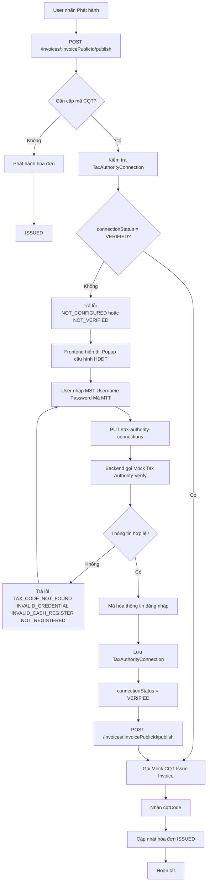

# Module Kết nối Cơ quan Thuế (Tax Authority Connection)

Module này quản lý và xác thực kết nối giữa hệ thống thuế của Hộ kinh doanh (HKD) với hệ thống Mock Cơ quan Thuế (CQT) để phát hành hóa đơn điện tử có mã.

---

# Luồng nghiệp vụ Phát hành & Cấp mã Hóa đơn điện tử

Dưới đây là quy trình từ thời điểm người dùng nhấn **Phát hành** cho đến khi hóa đơn được cấp mã Cơ quan Thuế.



---

# Các API liên quan

## 1. Lấy thông tin cấu hình kết nối hiện tại

### Endpoint

```http
GET /tax-authority-connections
```

### Response

```json
{
  "message": "Get tax connection initiated successfully.",
  "data": {
    "isConfigured": true,
    "taxCode": "0123456789",
    "cashRegisterCode": "ABCDE",
    "connectionStatus": "VERIFIED",
    "lastVerifiedAt": "2026-06-20"
  }
}
```

---

## 2. Thiết lập / Cập nhật cấu hình kết nối

### Endpoint

```http
PUT /tax-authority-connections
```

### Request

```json
{
  "taxCode": "0123456789",
  "username": "demo",
  "password": "123456",
  "cashRegisterCode": "ABCDE"
}
```

### Luồng xử lý

1. Backend gọi Mock API xác thực tài khoản CQT.
2. Nếu xác thực thất bại, trả về lỗi nghiệp vụ.
3. Nếu xác thực thành công:

   * Mã hóa username/password.
   * Upsert bản ghi TaxAuthorityConnection.
   * Cập nhật trạng thái VERIFIED.
   * Cập nhật lastVerifiedAt.

### Các mã lỗi

| Error Code            | Ý nghĩa                              |
| --------------------- | ------------------------------------ |
| TAX_CODE_NOT_FOUND    | Mã số thuế không tồn tại             |
| INVALID_CREDENTIAL    | Sai username hoặc password           |
| INVALID_CASH_REGISTER | Sai mã máy tính tiền                 |
| NOT_REGISTERED        | Chưa đăng ký sử dụng hóa đơn điện tử |

---

## 3. Phát hành & Cấp mã hóa đơn

### Endpoint

```http
POST /invoices/{invoicePublicId}/publish
```

### Luồng xử lý

1. Kiểm tra hóa đơn có thuộc diện cấp mã CQT hay không.
2. Nếu không thuộc diện cấp mã:

   * Phát hành hóa đơn theo luồng thông thường (Chuyển status sang ISSUED).
3. Nếu thuộc diện cấp mã:

   * Kiểm tra TaxAuthorityConnection của người dùng.
   * Nếu chưa cấu hình hoặc chưa xác thực:

     * Trả lỗi tương ứng để frontend hiển thị popup cấu hình.
   * Nếu đã xác thực:

     * Gọi Mock API cấp mã CQT.
     * Nhận mã CQT.
     * Cập nhật hóa đơn.
     * Chuyển trạng thái ISSUED.

### Các mã lỗi

| Error Code     | Ý nghĩa                           |
| -------------- | --------------------------------- |
| NOT_CONFIGURED | Chưa cấu hình tài khoản HĐĐT      |
| NOT_VERIFIED   | Tài khoản HĐĐT chưa được xác thực |

---

## 3. API Mock xác thực tài khoản Cơ quan Thuế

### Endpoint

```http
POST /v1/mock-tax-authority/verify
```

### Mục đích

API giả lập hệ thống T-VAN/Cơ quan Thuế dùng để kiểm tra tính hợp lệ của:

* Mã số thuế.
* Username.
* Password.
* Mã máy tính tiền.

API này chỉ được sử dụng nội bộ bởi backend khi xử lý `PUT /tax-authority-connections`.

---

## 4. API Mock cấp mã Cơ quan Thuế

### Endpoint

```http
POST /v1/mock-tax-authority/issue
```

### Mục đích

API giả lập hệ thống T-VAN/Cơ quan Thuế dùng để:

* Tiếp nhận dữ liệu hóa đơn.
* Sinh mã Cơ quan Thuế (cqtCode).
* Trả kết quả cấp mã cho hệ thống HKD.

API này chỉ được sử dụng nội bộ bởi backend khi xử lý `POST /invoices/{invoiceId}/issue`.
