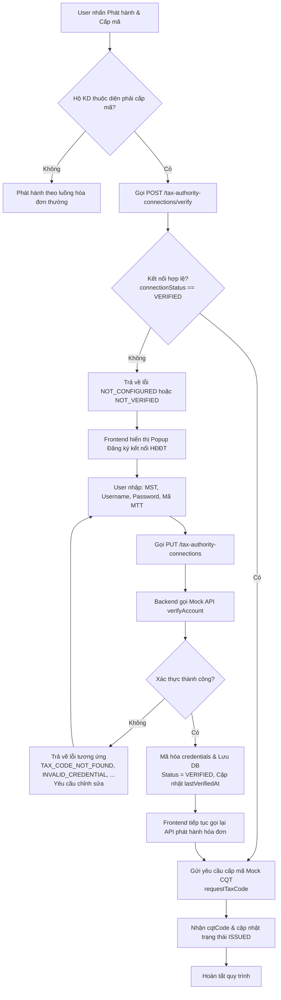

# Module Kết nối Cơ quan Thuế (Tax Authority Connection)

Module này quản lý và xác thực kết nối giữa hệ thống thuế của Hộ kinh doanh (HKD) với hệ thống Mock Cơ quan Thuế (CQT) để phát hành hóa đơn điện tử có mã.

---

## Luồng nghiệp vụ Phát hành & Cấp mã Hóa đơn điện tử

Dưới đây là sơ đồ quy trình từ bước người dùng nhấn **Phát hành & Cấp mã** trên Frontend cho đến khi nhận được mã Cơ quan Thuế (`cqtCode`):



---

## Các API liên quan

### 1. Kiểm tra trạng thái kết nối
* **Endpoint**: `POST /v1/tax-authority-connections/verify`
* **Mô tả**: Kiểm tra trạng thái cấu hình tài khoản thuế của HKD hiện tại.
* **Mã lỗi trả về nếu chưa hợp lệ**:
  * `NOT_CONFIGURED` (404): Chưa cấu hình thông tin tài khoản thuế.
  * `NOT_VERIFIED` (400): Tài khoản cấu hình tồn tại nhưng chưa ở trạng thái `VERIFIED`.

### 2. Thiết lập / Cập nhật cấu hình kết nối
* **Endpoint**: `PUT /v1/tax-authority-connections`
* **Body**:
  ```json
  {
    "taxCode": "0123456789",
    "username": "demo",
    "password": "123456",
    "cashRegisterCode": "ABCDE"
  }
  ```
* **Mô tả**:
  1. Gọi Mock API của CQT để kiểm tra tính hợp lệ của thông tin đăng nhập.
  2. Nếu xác thực không thành công, ném ra các lỗi nghiệp vụ:
     * `TAX_CODE_NOT_FOUND` (404): Mã số thuế không tồn tại.
     * `INVALID_CREDENTIAL` (400): Tên đăng nhập hoặc mật khẩu sai.
     * `INVALID_CASH_REGISTER` (400): Mã máy tính tiền không khớp.
     * `NOT_REGISTERED` (400): Hộ kinh doanh chưa đăng ký sử dụng hóa đơn điện tử.
  3. Nếu xác thực thành công, mã hóa `username` và `password`, lưu bản ghi `TaxAuthorityConnection` với trạng thái `VERIFIED` và thời gian xác thực `lastVerifiedAt`.

### 3. API Xác thực tài khoản của Mock Cơ quan Thuế
* **Endpoint**: `POST /v1/mock-tax-authority/verify`
* **Mô tả**: Endpoint mô phỏng hệ thống Cơ quan Thuế dùng để kiểm tra thông tin tài khoản của hộ kinh doanh.
